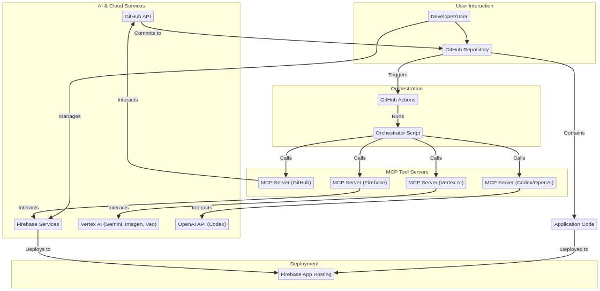

# RP Video Suite (manus_vidpro)

**Transform professional photography into cinematic video narratives with AI**

RP Video Suite is an innovative web application that bridges the gap between static photography and motion video, enabling photographers to deliver "living photographs" without traditional video editing expertise.

## 🎯 Project Vision

Transform professional photographers' still images into cinematic video narratives through an AI-powered, modular workflow that respects and amplifies the photographer's creative vision.

## 🏗️ Architecture

This project implements a cutting-edge agentic development approach, leveraging:

- **OpenAI Codex** for autonomous code generation and GitHub integration
- **Google Gemini & Vertex AI** for AI-powered storyboard and video generation
- **Firebase Studio** for rapid full-stack development
- **Model Context Protocol (MCP)** for standardized AI service orchestration



## 🚀 Tech Stack

### Frontend
- **React 18** with TypeScript and Vite
- **TailwindCSS** with Material Design 3 tokens
- **React Context** with useReducer for state management

### Backend & AI
- **Firebase** (Hosting, Functions, Firestore, Storage)
- **Vertex AI** (Gemini 2.5 Flash, Imagen 3, Veo 3)
- **Google Cloud Functions** as secure AI API proxy

### DevOps
- **GitHub Actions** for CI/CD
- **Docker** for MCP server containerization
- **Firebase App Hosting** for deployment

## 📋 Application Modules

The application consists of 8 core modules:

1. **Photographer Manifesto** - Creative identity establishment
2. **Project Foundation** - Project brief and collaborative notes
3. **Final Image Assets** - Bulk upload and gallery management
4. **Key Frames** - Storyboard strips with aspect ratio controls
5. **Key Frame Storyboard** - AI-generated storyboard options
6. **Approved Storyboard** - Final storyboard selection and editing
7. **Video Key Frames** - Beat grid controls and clip generation
8. **Scene Builder** - Timeline assembly and export

## 🤖 Agentic Development Process

This project is built using an autonomous development workflow defined in `TASKS_P0.yaml`. The development process is orchestrated through:

- **GitHub Actions** workflows that trigger on repository events
- **MCP Tool Servers** that provide standardized interfaces to AI services
- **Orchestrator Scripts** that execute tasks based on dependency graphs

## 📚 Documentation

- [`project_analysis.md`](project_analysis.md) - Detailed project requirements and technical specifications
- [`development_roadmap.md`](development_roadmap.md) - Complete implementation strategy and architecture
- [`ai_platforms_research.md`](ai_platforms_research.md) - Research on AI development platforms and capabilities
- [`TASKS_P0.yaml`](TASKS_P0.yaml) - Task definitions for the agentic development process

## 🔧 Development Setup

### Prerequisites
- Node.js 18+ and npm
- Firebase CLI
- Docker (for MCP servers)
- GitHub CLI (for repository management)

### Quick Start
```bash
# Clone the repository
git clone https://github.com/JuiceBlaster/manus_vidpro.git
cd manus_vidpro

# Install dependencies
npm install

# Start development server
npm run dev

# Start Firebase emulators
npm run emu
```

## 🚀 Deployment

The application is automatically deployed to Firebase App Hosting through GitHub Actions. Every push to the `main` branch triggers:

1. Automated testing and quality checks
2. Build optimization and bundling
3. Deployment to Firebase hosting
4. Function deployment to Google Cloud

## 🔐 Security & API Keys

All AI API keys are securely managed through Firebase environment configuration. The application follows a Backend-for-Frontend (BFF) pattern where all AI API calls are proxied through Firebase Cloud Functions, ensuring API keys never reach the client.

## 📊 Cost Optimization

The project is designed to maximize free tier usage across platforms:

- **Firebase Spark Plan** for hosting and basic services
- **Vertex AI Free Tier** for AI model access
- **GitHub Free Tier** for repository and Actions
- **Existing ChatGPT Plus** subscription for Codex access

## 🤝 Contributing

This project uses an agentic development approach. Contributions are managed through:

1. Issues created from task definitions
2. Automated code generation and review
3. AI-powered testing and quality assurance
4. Autonomous deployment and monitoring

## 📄 License

MIT License - see [LICENSE](LICENSE) file for details.

## 🙏 Acknowledgments

Built with **Manus AI** - leveraging cutting-edge agentic development capabilities to transform ideas into production-ready applications.

---

**Status**: 🚧 Under active agentic development

**Live Demo**: Coming soon...
